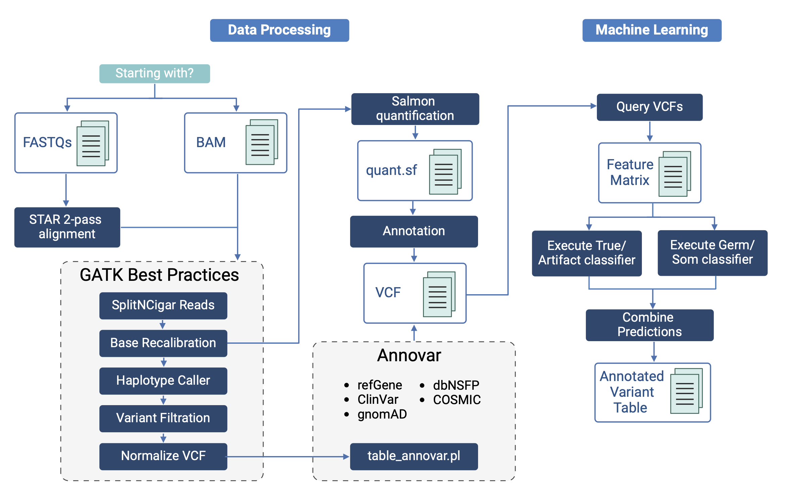

# VarRNA 

[](https://doi.org/10.5281/zenodo.14699944)

`VarRNA` is a comprehensive pipeline designed to process RNA-Seq reads from tumor samples, starting with either FASTQ or BAM files. It identifies single nucleotide variants (SNVs) and indels, and classifies these variants as germline, somatic, or artifact. Leveraging Snakemake, `VarRNA` efficiently tracks each step and processes multiple samples in parallel. The pipeline requires minimal configuration of input sample paths and manages most dependencies through a micromamba environment.The models are set up to evaluate RNA-Seq data aligned to human reference version GRCh38.




System Requirements
======

`VarRNA` can run on a standard computer, provided it has sufficient RAM for in-memory operations. However, for optimal performance and efficiency, especially when processing multiple samples simultaneously, we recommend using a high-performance computing environment. This setup will allow you to fully leverage the parallel processing capabilities.


Installation
=====

## Clone the repository

```
git clone https://github.com/nch-igm/VarRNA.git
cd VarRNA
```

## Set up the environment
Install [micromamba](https://mamba.readthedocs.io/en/latest/installation/micromamba-installation.html). Create and activate the environment:
```
micromamba env create -f dependencies/mamba_environment.yml
micromamba activate varrna
```

## Install ANNOVAR

Download and extract [ANNOVAR](https://annovar.openbioinformatics.org/en/latest/user-guide/download/) (requires user agreement):
```bash
wget <link/to/annovar/tar/file> -P dependencies/
tar -xvzf dependencies/annovar.latest.tar.gz -C dependencies/
```

## Download Resources

### XGBoost models and custom resources
```bash
aws s3 sync s3://igm-public-dropbox/varrna/ resources/ --no-sign-request
```

### Public resources
Run the following scripts to download and process additional resources:
```bash
bash get_resources.sh
bash process_resources.sh
```

You should have the following resources:
```
resources/
    dbsnp151_common.hg38.vcf.gz
    dbsnp151_common.hg38.vcf.gz.tbi
    example_data/
        SRR31139166.Aligned.sortedByCoord.out.chr22.bam
        SRR31139166.Aligned.sortedByCoord.out.chr22.bam.bai
    gencode.v43.primary_assembly.annotation.gtf
    gencode.v43.primary_assembly.gene_name.bed.gz
    gencode.v43.primary_assembly.gene_name.bed.gz.tbi
    gencode.v47.transcripts.fa.gz
    GRCh38.p13.genome.dict
    GRCh38.p13.genome.fa
    GRCh38.p13.genome.fa.fai
    ref/
        gentrome.fa.gz
        IDT.Exomev2.targets.GRCh38.sorted.merged.bed
    repmask_hg38.bed
    RNAedit.sorted.vcf.gz
    RNAedit.sorted.vcf.gz.tbi
    vcf_header.txt
    xgb/
        xgb_germsom.pkl
        xgb_trueartifact.pkl
```


Input data
======

## A. FASTQ files
Prepare RNA-Seq FASTQ files by performing quality control (e.g., FastQC) and read trimming. Use the provided scripts to align reads with STAR:
```bash
cd Alignment
bash get_star.sh              # Download STAR
bash star_genome_build.sh     # Build genome index (edit `sjdbOverhang` if necessary)
bash star_alignment.sh <sample>  # Align reads
```


## B. BAM files

Ensure consistency between the reference genome used for alignment and the pipeline's reference. Update `config/config.yaml` (reference - fasta) to match the BAM file reference.


## Sample input file

Modify the ```config/samples.csv``` file to add the sample names and paths.


Output files
======
Key results include annotated VCF files and variant predictions:
```bash
results/<sample>/VCFs/annotated/<sample>.annotated.vcf.gz
results/<sample>/Predictions/<sample>.annotated_predictions.csv
```

Execution
======

## HPC environment
For batch systems (e.g., SGE), use scheduler.sh. Create a directory for separate log files:
```bash
cd workflow
mkdir qsub_logfiles
qsub scheduler.sh
```
Adjust --jobs to the number of concurrent jobs supported by your system. Refer to [Snakemake CLI documentation](https://snakemake.readthedocs.io/en/stable/executing/cli.html) for more options.

## Local execution
Run the pipeline locally by specifying available cores:
```bash
cd workflow
snakemake --cores 2
```

## Example usage - testing the pipeline

### Step 1: setup
To confirm that VarRNA is set up correctly, use the provided test dataset referenced in the `config/samples.csv` file:
```
sample,file_path
SRR31139166,../results/SRR31139166/BAMs/SRR31139166.Aligned.sortedByCoord.out.chr22.bam
```

### Step 2: run the test
Test the pipeline with the same command used to run future samples. E.g.: 
```bash
cd workflow
mkdir qsub_logfiles
qsub scheduler.sh
```


### Step 3: check outputs
Upon successful completion you should see this in the snakemake logs (`.snakemake/log/*`)
```
Finished job 0.
45 of 45 steps (100%) done
```

Ensure the final output file contains variants with predictions:
```
results/SRR31139166/Predictions/SRR31139166.annotated_predictions.csv
```

